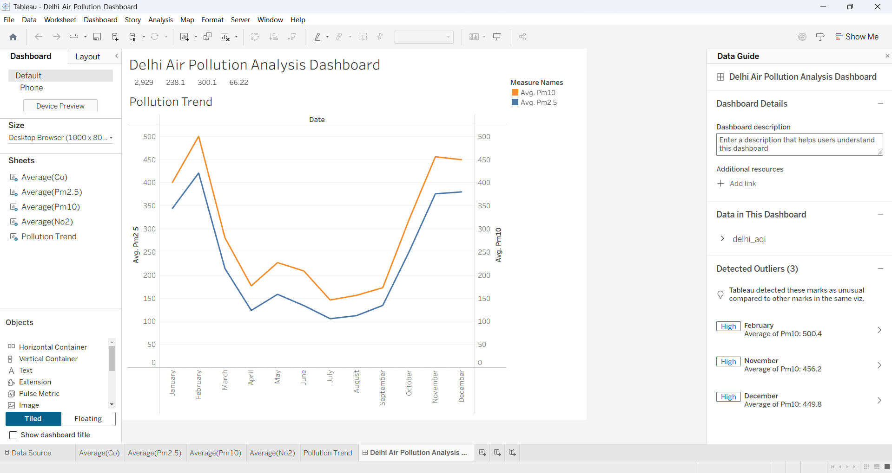

# 🌍 Delhi Air Pollution Analysis Dashboard



## 📌 Overview

The **Delhi Air Pollution Analysis Dashboard** is an interactive Tableau project designed to analyze and visualize air pollution trends in Delhi. The dashboard helps users understand the variation in pollutant concentrations over different months through intuitive visualizations.

This project demonstrates the use of **data visualization techniques** to transform raw environmental data into meaningful insights.

---

## 🚀 Features

- 📈 Monthly Pollution Trend Analysis
- 🌫️ PM2.5 and PM10 Comparison
- 📊 Interactive Tableau Dashboard
- 🔍 Easy-to-understand Visualizations
- 📅 Time-based Analysis of Air Quality

---

## 🛠️ Technologies Used

- **Tableau Desktop**
- **Git**
- **GitHub**
- **CSV Dataset**

---

## 📂 Project Structure

```
Delhi-Air-Pollution-Dashboard/
│
├── Delhi_Air_Pollution_Dashboard.twb
├── dashboard.png
└── README.md
```

---

## 📊 Dashboard Preview

The dashboard provides:

- Pollution Trend Analysis
- Average PM2.5 Levels
- Average PM10 Levels
- Monthly Air Quality Comparison

---

## 🎯 Objectives

- Analyze Delhi's air pollution data.
- Visualize pollutant concentration trends.
- Understand seasonal variations in air quality.
- Build an interactive dashboard using Tableau.

---

## 📁 Dataset

The dashboard uses a CSV dataset containing monthly air pollution measurements for Delhi.

Key attributes include:
- Month
- PM2.5
- PM10
- NO2
- CO

---

## ▶️ How to Use

1. Clone this repository:

```bash
git clone https://github.com/Manaswini1907/Delhi-Air-Pollution-Dashboard.git
```

2. Open the project in Tableau Desktop:

```
Delhi_Air_Pollution_Dashboard.twb
```

3. If prompted, reconnect the data source.

4. Explore the dashboard and analyze the pollution trends.

---

## 📈 Key Insights

- Pollution levels are highest during winter months.
- PM10 values remain consistently higher than PM2.5.
- Air quality improves during the monsoon season.
- Seasonal patterns have a significant impact on pollution levels.

---

## 🔮 Future Enhancements

- Add real-time AQI data integration.
- Include additional pollutant analysis.
- Publish the dashboard on Tableau Public.
- Add forecasting and predictive analytics.

---

## 👩‍💻 Author

**Sai Manaswini**

GitHub Profile:
https://github.com/Manaswini1907

---

## ⭐ Support

If you found this project useful, consider giving it a ⭐ on GitHub!
